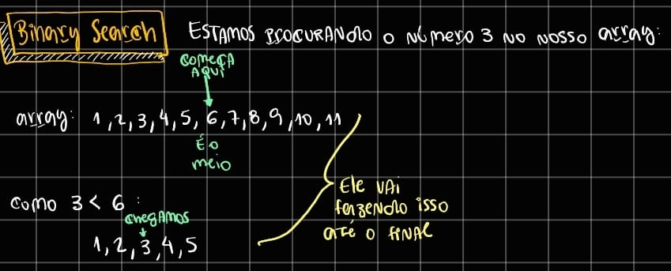

# Binary Search
Só funciona se os itens estiverem **ordenados** a complexidade computacional dele temporal é: $O(\log n)$ e espacial (memória) é $O(1)$ ele não aloca nenhum espaço adicional na memória.

```python
def binary_search(nums: int, n: int) -> int:
    l = 0
    r = len(nums)
    steps = 0
    while l < r:
        steps += 1
        mid = int((l + r) / 2)
        if nums[mid] == n:
            print(f'{steps=}')
            return mid
        elif nums[mid] < n:
            l = mid + 1
        else:
            r = mid
    return -1  # número não foi encontrado

```