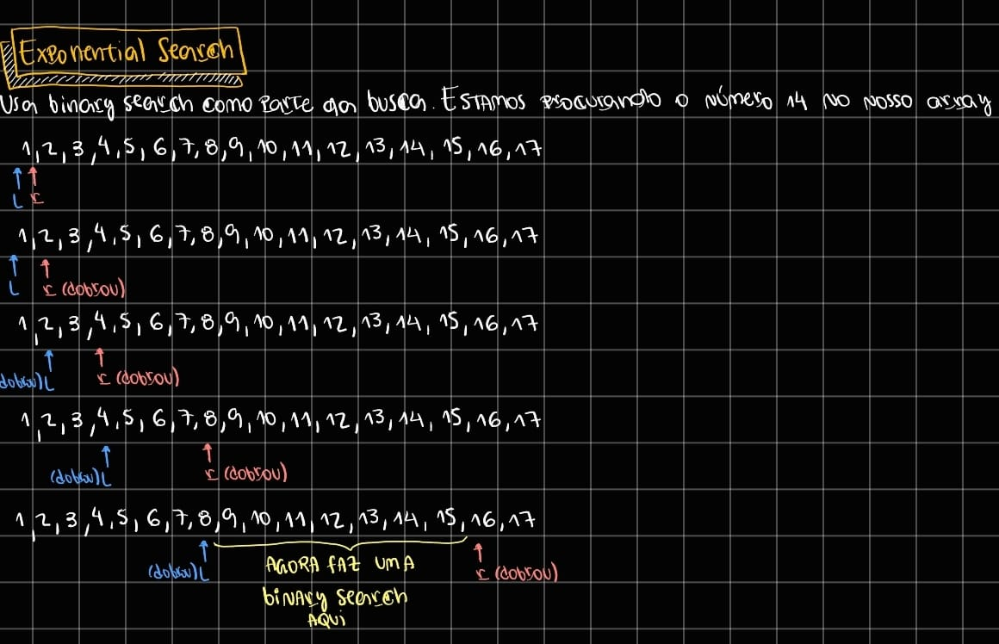

# Exponential Search
Usa binary search como parte da busca, tem complexidade temporal $O(\log n)$ e espacial $O(1)$. Ela dobra a busca a cada iteração, isso porque talvez o valor buscado pode aparecer "cedo" e você não precisaria buscar por todo array como numa binary search, a exponential search sai do primeiro número e vai dobrando até englobar o valor encontrado e depois utiliza a binary search para chegar ao valor.

