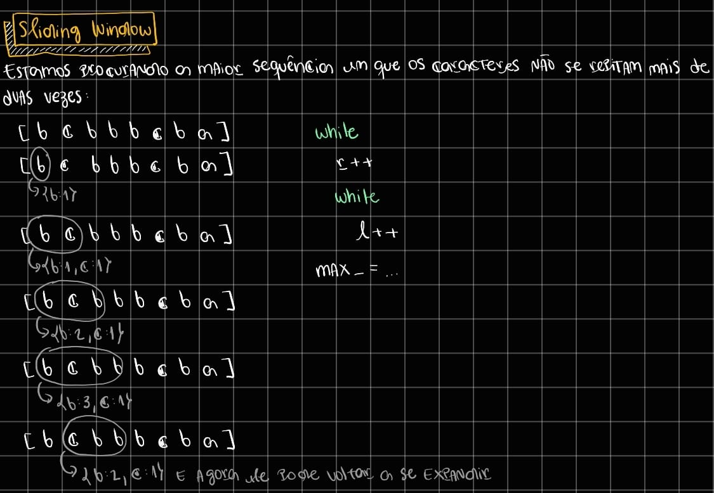

# Sliding Window
Resolve um problema com sub-arrays, por exemplo: O maior sub-array que alterna entre números ímpares e números pares em um array.
Você terá dois `while` um que expande o ponteiro da direira `r` e outro dentro que expande o ponteiro da esquerda `l` (isso faz a janela expandir e contrair).

