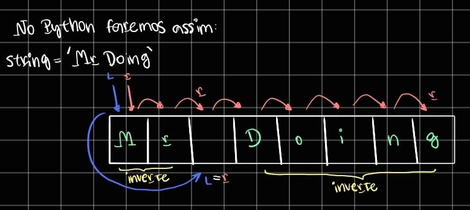

# Two Pointer
- Inicializa dois ponteiros um no inicio e um no fim e manipula esses ponteiros.

```python
def reverse_words(string: str) -> str:  # O(n) both
    res = ''
    l, r = 0, 0  # pointers
    while r < len(string):
        if string[r] != ' ':
            r += 1
        else:
            res += string[l:r + 1][::-1]
            r += 1
            l = r
    # Aqui ele está na ultima letra e não cai mais dentro do else
    res += ' '
    res += string[l:][::-1]
    return res[1:]
```