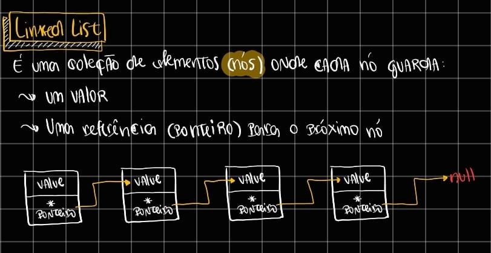

# Linked Lists
São como *nós*, onde cada um possui um valor e ponteiro que aponta para o próximo valor da **linked list**. Diferentes de arrays, os elementos não ficam armazenados de forma contígua na memória, o que torna o acesso por índice ineficiente, mas permite inserções e remoções eficientes sem a necessidade de mover outros elementos. Sua complexidade para percorrer todos os elementos da **linked list** é `O(n)`.
