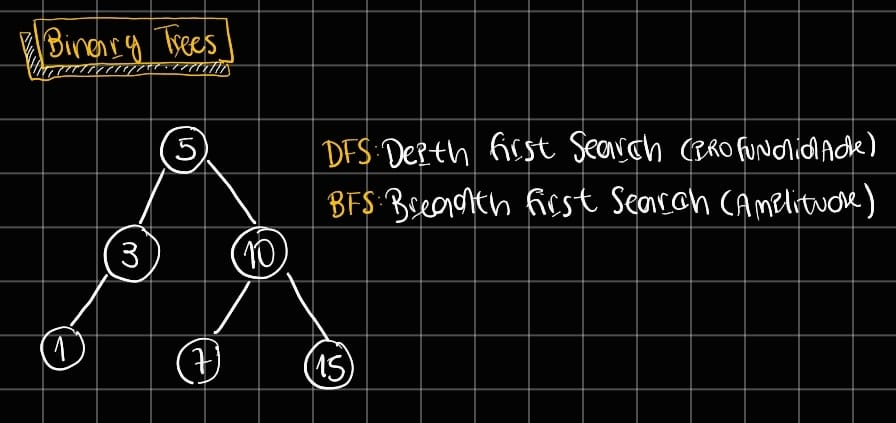

# Binary Tree

Uma binary tree é uma estrutura de dados hierárquica em que cada nó possui, no máximo, dois filhos, normalmente chamados de esquerdo e direito, sendo muito usada para organizar dados de forma eficiente e facilitar operações como busca, inserção e travessia. Para percorrer uma árvore, existem duas estratégias principais: DFS (Depth-First Search) e BFS (Breadth-First Search). No DFS, a exploração vai o mais fundo possível em um ramo antes de voltar, e pode ser feita de três formas clássicas — preorder (nó → esquerda → direita), inorder (esquerda → nó → direita) e postorder (esquerda → direita → nó) — sendo o inorder especialmente útil em árvores de busca binária por retornar os valores ordenados. Já o BFS percorre a árvore nível por nível, da raiz para baixo, usando normalmente uma fila, e é útil quando se quer encontrar o caminho mais curto ou analisar a estrutura da árvore por camadas.

