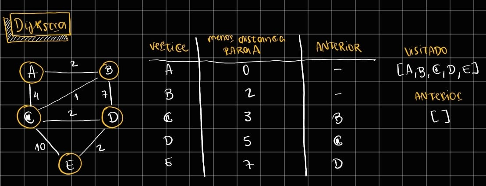

# Algoritmo de Dijkstra
Esse algoritmo busca encontrar o menor caminho até certo ponto.
Ele é um método eficiente para encontrar o caminho mais curto entre um nó inicial e todos os outros nós em um grafo com pesos não negativos, utilizando uma abordagem gulosa que explora os vértices mais próximos primeiro a partir de uma fila de prioridade, garantindo assim que, quando um nó é processado, a menor distância até ele já foi encontrada.

