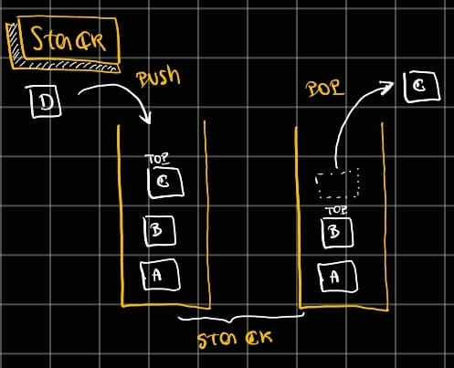

# Stack
Uma stack (pilha) em DSA é uma estrutura de dados linear que segue o princípio LIFO (Last In, First Out), ou seja, o último elemento inserido é o primeiro a ser removido, como uma pilha de pratos. As operações básicas são push (inserir no topo), pop (remover do topo) e peek/top (ver o elemento do topo), todas geralmente executadas em tempo constante O(1). Stacks são amplamente usadas para controlar execução e estado em algoritmos, como a call stack de funções, verificação de expressões balanceadas, backtracking, DFS em grafos e árvores, e desfazer/refazer ações em aplicações.

