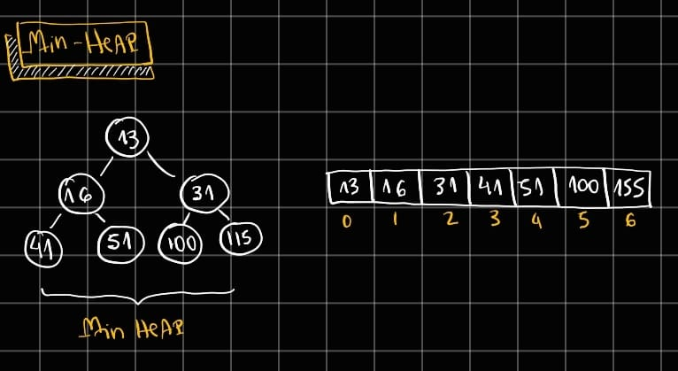

# Heap (Priority Queue)
Uma MinHeap em DSA é uma estrutura de dados baseada em árvore binária completa onde o menor elemento está sempre na raiz, e cada nó pai tem valor menor ou igual ao de seus filhos, garantindo a chamada propriedade de heap. Essa organização permite acessar o menor elemento em O(1) e inserir ou remover elementos em O(log n), pois apenas uma pequena parte da árvore precisa ser ajustada. MinHeaps são amplamente usadas em algoritmos como Dijkstra, Prim, filas de prioridade e sistemas de agendamento, onde é essencial sempre extrair rapidamente o menor valor disponível.
